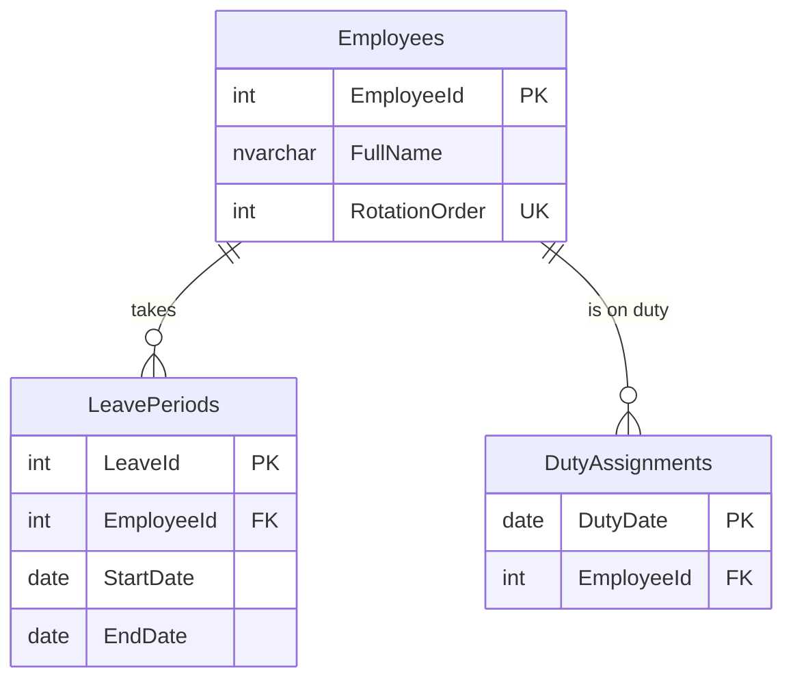

# Duty Rotation Scheduler (T-SQL)

A fair, leave-aware on-call rotation generator built entirely in T-SQL on SQL Server 2022.

> A re-implementation, with synthetic data, of a scheduling solution I built during my
> BI & DWH internship. No company data is used here.

## Problem

The BI & DWH team had an on-call duty to monitor the data warehouses and databases.
Every day, weekends included, one person checked the systems to catch anomalies and
raised a ticket when something went wrong. The hard part was planning the shifts by hand
every week: whenever someone went on leave, the order shifted and the plan had to be
fixed manually. With the Duty Rotation Scheduler, this is no longer manual. Once you run
a command, it builds a 12-month schedule, and whenever someone goes on leave, the
schedule is updated automatically.

## Business rules

| Rule | Description |
|---|---|
| **BR-1** | Duty is **daily**. Every calendar day is a duty day, weekends and public holidays included. |
| **BR-2** | Exactly **one** employee is on duty each day. No day is empty, no day has two people. |
| **BR-3** | Employees have a fixed **rotation order**. Duty is assigned in that order and wraps around at the end. |
| **BR-4** | An employee on leave is **skipped**. The next available employee takes the day, and the rotation continues from that point. |
| **BR-5** | If the next employee is also on leave, the search continues until someone is available. |
| **BR-6** | There is **no make-up** for duties missed during leave. After long leave, duty counts may differ. |
| **BR-7** | Leave is added **after** the plan exists. The plan is re-built only **from the first day of the leave**. Earlier days never change. |
| **BR-8** | If nobody is available on a day, the operation **fails and is rolled back**. A half-built plan is never saved. |

## Data model



| Object | Type | Purpose |
|---|---|---|
| `fn_IsOnLeave(@EmployeeId, @Date)` | Function | Returns 1 if the employee is on leave on that date |
| `fn_NextAvailableEmployee(@StartOrder, @Date)` | Function | First employee in rotation order, starting at `@StartOrder` and wrapping around, who is not on leave. `NULL` if nobody is available |
| `usp_AssignDuties(@FromDate, @ToDate)` | Procedure | The engine: re-builds the plan for a date range, day by day |
| `usp_GenerateRotation(@StartDate, @Months)` | Procedure | Builds a plan of 1 to 12 months |
| `usp_AddLeave(@EmployeeId, @StartDate, @EndDate)` | Procedure | Records a leave and re-plans from its first day, in one transaction |

## How to run

**Requirements:** Docker Desktop and Git.

```bash
git clone https://github.com/Hakansatir/duty-rotation-scheduler-tsql.git
cd duty-rotation-scheduler-tsql

cp .env.example .env          # then set your own SA password in .env
docker compose up -d          # wait ~20 seconds for SQL Server to start
```

Build everything from scratch (schema, seed data, functions, procedures and a 12-month plan):

```bash
docker exec duty-rotation-sql bash -c '/opt/mssql-tools18/bin/sqlcmd -S localhost -U sa -P "$MSSQL_SA_PASSWORD" -C -b -i /sql/run_all.sql'
```

Run the tests:

```bash
for f in tests/test_*.sql; do
  docker exec duty-rotation-sql bash -c "/opt/mssql-tools18/bin/sqlcmd -S localhost -U sa -P \"\$MSSQL_SA_PASSWORD\" -C -b -i /$f" || break
done
```

> **Windows + Git Bash:** run `export MSYS_NO_PATHCONV=1` first. Otherwise Git Bash rewrites
> container paths such as `/sql/run_all.sql` into Windows paths and the commands fail.

Add a leave and re-plan (inside `sqlcmd`, database `DutyRotation`):

```sql
EXEC dbo.usp_AddLeave @EmployeeId = 2, @StartDate = '2026-12-14', @EndDate = '2026-12-16';
```

## Sample output

The seed contains 11 employees (named alphabetically, so the rotation can be followed by eye) and
four leave periods, each chosen to exercise a specific rule. The plan starts on 2026-10-01.

**Skipping an employee on leave (BR-4).** Carla is on leave on 3 October, so David takes the day
and the rotation continues from him:

```
DutyDate     Employee
2026-10-01   Anna Weber
2026-10-02   Bruno Fischer
2026-10-03   David Novak        <- Carla is on leave
2026-10-04   Elena Petrova
2026-10-05   Farid Haddad
```

**Two employees in a row on leave (BR-5).** Hugo (5–16 Nov) and Irina (6–17 Nov) are next to each
other in the rotation. Both are skipped, and both return exactly at their next turn:

```
DutyDate     Employee
2026-11-07   Greta Lindqvist
2026-11-08   Jonas Keller       <- Hugo and Irina are both on leave
2026-11-09   Kaya Demir
...
2026-11-16   Greta Lindqvist
2026-11-17   Hugo Martins       <- back from leave
2026-11-18   Irina Kovacs       <- back from leave
```

**Adding a leave to an existing plan (BR-7).** Bruno takes leave on 14–16 December. Days before
the leave are unchanged; from the first day of the leave the plan is re-built:

```
DutyDate     Before            After
2026-12-12   Kaya Demir        Kaya Demir
2026-12-13   Anna Weber        Anna Weber
2026-12-14   Bruno Fischer     Carla Mendes     <- re-planned from here
2026-12-15   Carla Mendes      David Novak
2026-12-16   David Novak       Elena Petrova
2026-12-17   Elena Petrova     Farid Haddad
```

Bruno's next duty is on 24 December, when his turn comes again.

**Duty counts over 12 months (365 days).** Without leave every count would be 33 or 34 (BR-3).
Hugo and Irina have 32 because missed duties are not made up (BR-6):

```
Anna 34 · Bruno 34 · Carla 33 · David 34 · Elena 33 · Farid 34
Greta 33 · Hugo 32 · Irina 32 · Jonas 33 · Kaya 33
```

**Tests:**

```
PASS BR-2: every day of the plan has an employee.
PASS BR-3: without leave, duty counts differ by at most one.
PASS BR-4: nobody is on duty while on leave.
PASS BR-7: days before the leave are unchanged.
```

## Design decisions

- **`DutyDate` is the primary key of `DutyAssignments`.** A natural key instead of an extra
  identity column: it is unique by definition, and it makes BR-2 ("one employee per day") a rule
  the table itself enforces, not something the code has to remember.
- **`RotationOrder` is separate from `EmployeeId`.** The identity column only identifies a person;
  the rotation order is a business rule. Swapping two people in the rotation is a single `UPDATE`
  and never touches the ids that other tables refer to.
- **Named constraints** (`PK_`, `FK_`, `UQ_`, `CK_`). Error messages then name the rule that was
  broken, e.g. `CK_LeavePeriods_DateOrder`, instead of a generated name.
- **A loop for the assignment step.** My first version was set-based: day *n* went to rotation
  position `n % 11 + 1`. Leave breaks that: skipping someone shifts every following day, so each
  day depends on the day before. That is a sequential problem, so `usp_AssignDuties` walks the
  days one by one. Everything else (date ranges, validation, tests) stays set-based.
- **Cyclic search in one query.** `fn_NextAvailableEmployee` orders employees with
  `CASE WHEN RotationOrder >= @StartOrder THEN 0 ELSE 1 END, RotationOrder`, which starts at the
  pointer and wraps around to the top, then takes the first one who is not on leave.
- **Continuity.** When the plan is re-built from a date, the rotation starts right after whoever
  was on duty the day before, not from the top of the list.
- **One engine, two entry points.** `usp_GenerateRotation` (months) and `usp_AddLeave` (from the
  leave's first day to the end of the plan) both call `usp_AssignDuties`, so the rules live in
  one place.
- **Transactions.** `usp_AddLeave` records the leave and re-plans in one transaction with
  `SET XACT_ABORT ON`: if re-planning fails, the leave is not saved either (BR-8).
- **Functions return `NULL`, procedures raise errors.** SQL Server does not allow `THROW` inside a
  function, so `fn_NextAvailableEmployee` returns `NULL` when nobody is available and the caller
  raises the error.
- **`usp_` prefix, not `sp_`.** SQL Server reserves `sp_` for system procedures and looks those up
  in `master` first.
- **Tests leave no trace.** Tests that change data run inside a transaction and roll it back.
- **Deterministic seed.** Employee ids are written explicitly (`IDENTITY_INSERT`), so tests and the
  sample output above always refer to the same people.

## Known limitations

- `usp_GenerateRotation` does not yet run inside its own transaction, so a failure in the middle
  of a new plan (BR-8) could leave a partial plan. `usp_AddLeave` is already protected.
- Out of scope for v1.0: public holiday calendar, multiple teams, a UI or Power BI report.

## Repository layout

```
├── docker-compose.yml     SQL Server 2022 container
├── .env.example           template for the SA password (.env is git-ignored)
├── sql/
│   ├── 01_schema.sql      tables and constraints
│   ├── 02_seed.sql        synthetic employees and leave periods
│   ├── 03_functions.sql   fn_IsOnLeave, fn_NextAvailableEmployee
│   ├── 04_procedures.sql  usp_AssignDuties, usp_GenerateRotation, usp_AddLeave
│   └── run_all.sql        builds everything from scratch
└── tests/                 one script per business rule
```

## Tech

SQL Server 2022 · T-SQL · Docker Compose
